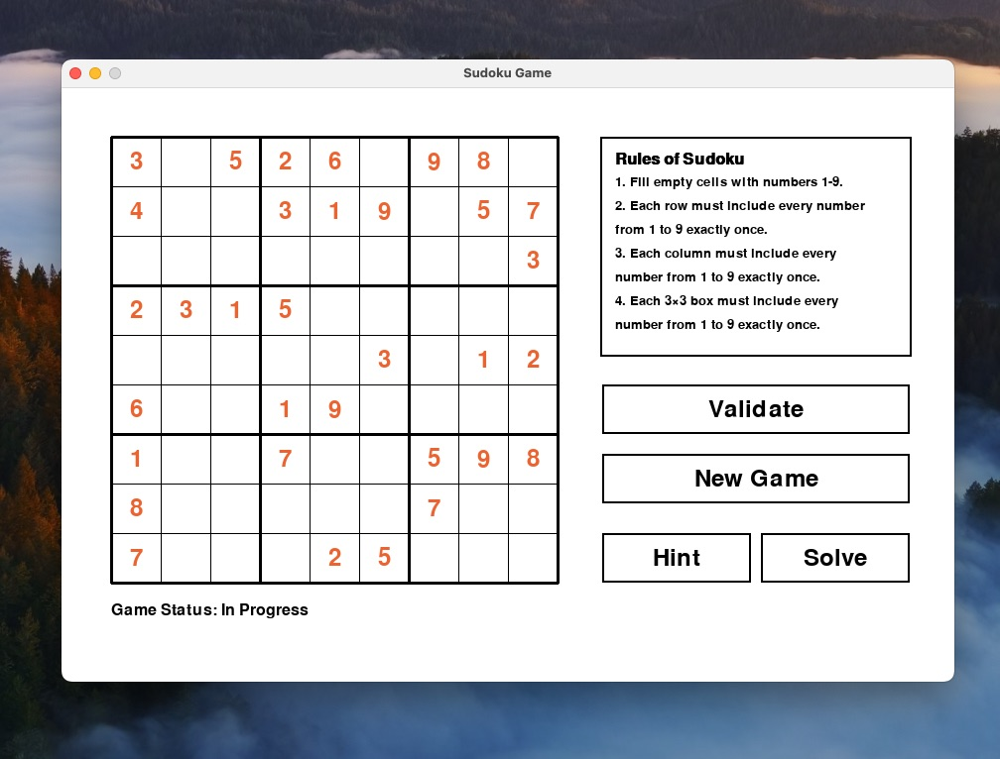

# Sudoku-Game-and-Solver

This is a Python implementation of s Sudoku game along with a solver. This project was built to explore a practical application of backtracking algorithms using the popular Sudoku puzzle.

### User Solving Puzzle


### Computer Solving Puzzle


## Key Game Features

- Get hints that reveal a number in a random empty cell.
- Validate your current solution at any time.
- View the complete solution with the solve button.



## Technical Implementation

### Project Structure

The code is split into three main parts:

- Domain: These are the core game entities which include (`SudokuBoard`, `SudokuCell`)
- Services: This holds the main game logic that handles the board generation, validation and the solver (`SudokuGenerator`, `SudokuSolver`, `SudokuValidator`).
- Views: These are the all PyGame classes that manage the GUI (i.e., all the user interaction).

### Algorithms Used

#### Puzzle Generation:

Generating a valid Sudoku puzzle (`SudokuGenerator`) required the use of a Sudoku solver. The generation processes works as below.

1. Generate an empty sudoku board.
2. Place random seeds as a starting point.
3. Utilise the solver to fully solve the current board.
4. I then remove random cells, check if the board still has a unique solution. If it does, then continue. If not, place that removed value back into the board.
   - For this project, I only generate easy-medium puzzles which have approximately 30 fixed cells out of the 81.

#### Sudoku Solver:

The Sudoku solver is implemented using a **backtracking** approach. You can read more about backtracking [here](https://www.geeksforgeeks.org/introduction-to-backtracking-2/).

The high level steps of the solver are as follows:

1. First need to check if the board is actually valid.
2. Next, it finds an empty cell (currently it finds the first empty cell, but looking to use MRV algorithm to optimise this step).
3. Then, it attempts to place a number between 1–9 in the empty cell, recursively solving the board with each choice. If a solution is not found, it **backtracks** and try the next possible number.

## Unit Testing

I've included several unit testing test cases using Pytest to ensure the correctness of both the validator and the solver. These can be found in the tests folder.

1. To run the unit tests, ensure you have PyTest installed first.

```
pip3 install pytest
```

2. To run the solver tests, run the follow command:

```
pytest -v -s tests/solver/test_sudoku_solver.py
```

3. To run the solver tests, run the follow command:

```
pytest -v -s tests/validator/test_sudoku_validator.py
```

To add your own test cases, open the relevant test file (test_sudoku_validator.py or test_sudoku_solver.py) and add test cases like below:

```
# 0's represent empty cells
# numbered cells represent fixed cells
([
    [6,0,0,0,0,7,4,3,0],
    [0,0,3,0,0,0,6,8,2],
    [0,4,8,0,0,3,0,9,0],
    [7,6,0,0,4,1,0,0,0],
    [0,0,2,7,0,5,1,0,0],
    [0,0,0,3,8,0,0,7,9],
    [0,3,0,1,0,0,9,2,0],
    [8,1,4,0,0,0,5,0,0],
    [0,2,7,5,0,0,0,0,4]
], "new test case name"),
```

## How to Run the Game

1. Ensure Python is installed (project was developed with Python 3.12.2)
2. Install PyGame.

   ```
   pip3 install pygame
   ```

3. Run the game.
   ```
   python3 main.py
   ```
